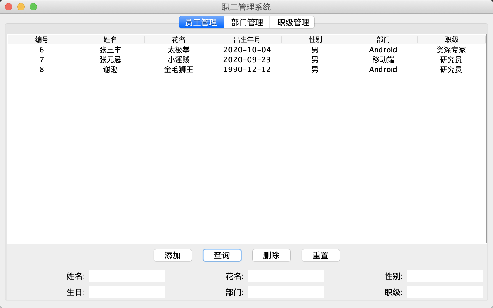
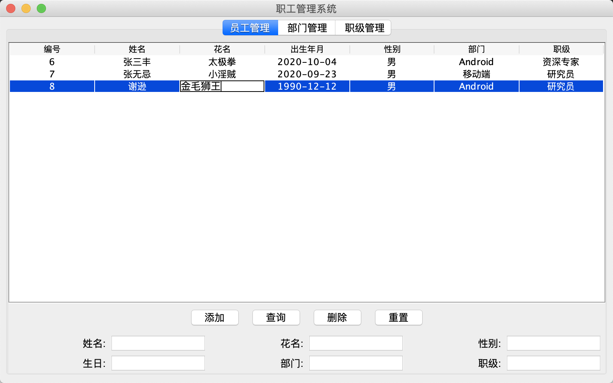
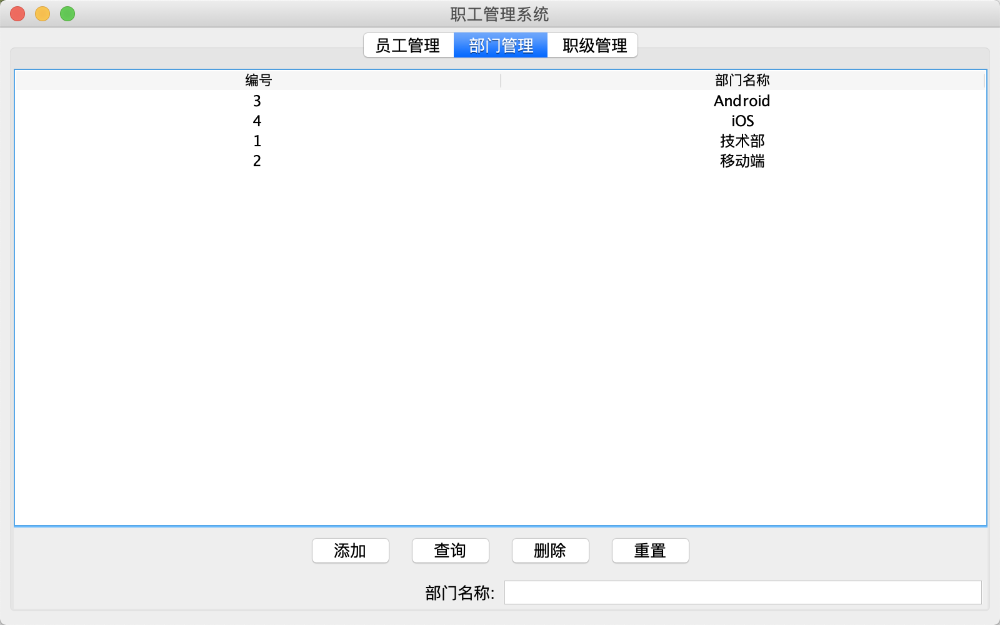
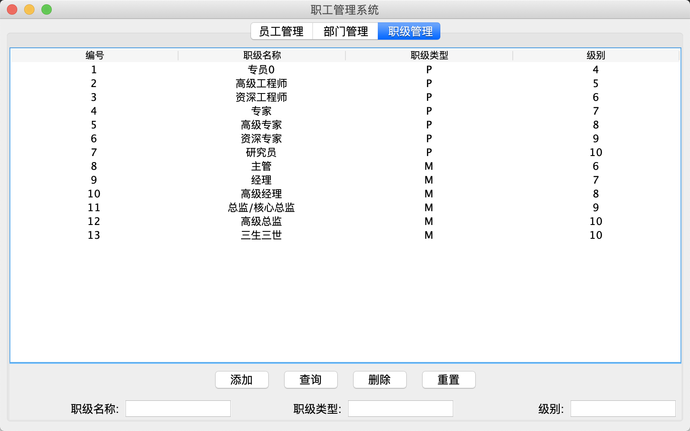

## A Employee Manager System by Java Swing

## 员工管理

## 部门管理

## 职级管理

## Reference

- https://docs.oracle.com/javase/tutorial/uiswing/examples/components/index.html
- https://docs.oracle.com/javase/tutorial/uiswing/TOC.html
- https://docs.oracle.com/javase/tutorial/uiswing/examples/concurrency/index.html

